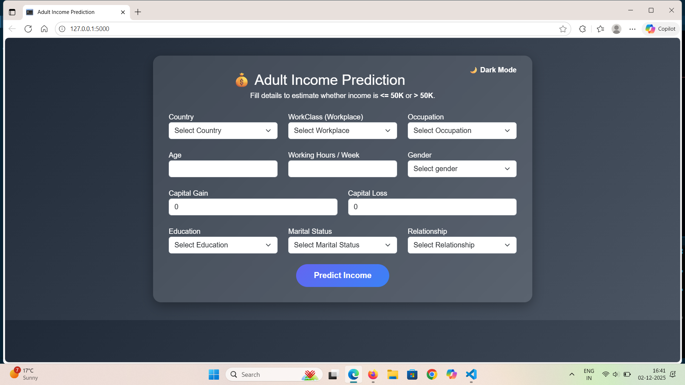
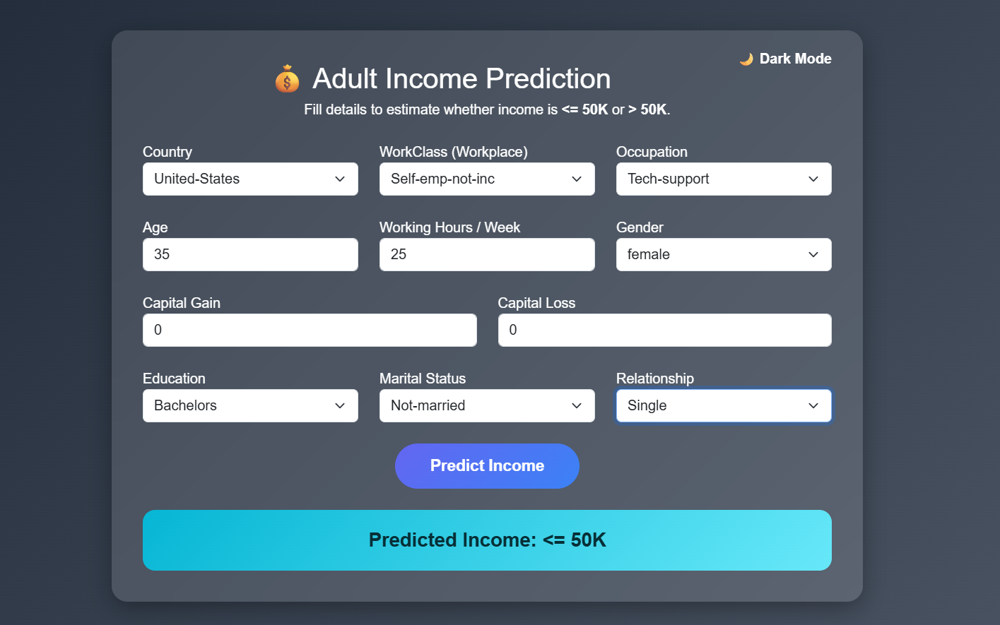

# 🌟 Adult Income Classification – Machine Learning Flask Web App

Predict whether a person earns **> 50K** or **≤ 50K** using a machine-learning model trained on the **Adult Census Income Dataset (UCI)**.

This project includes a fully functional **Flask web application** with a clean UI for interacting with the prediction model.

## 📌 Project Highlights
- 🚀 Flask Web App with clean UI  
- 🤖 Machine Learning Model (`model.pkl`)  
- 🧠 Feature engineering with One-Hot Encoding + Education Mapping  
- 📊 Handles both categorical & numerical inputs  
- ✔ Automatic feature alignment with trained model  
- 🌍 Ready for deployment (Heroku / Render / PythonAnywhere / AWS)  

## 📸 Screenshots

| Home Page | Prediction Result |
|-----------|-------------------|
|  |  |

## 📁 Project Structure

│── app.py 
│── model.pkl 
│── templates/
│ └── index.html 
│── static/
│ └── style.css
│── README.md

### 🔹 Input Features Captured:

- Age  
- Workclass  
- Education  
- Marital Status  
- Occupation  
- Relationship  
- Sex  
- Capital Gain  
- Capital Loss  
- Hours per Week  
- Country  

### 🔹 Education Level Mapping
Education values are converted into numerical levels before prediction, e.g.:

Preschool → 1
Doctorate → 16

### 🔹 One-Hot Encoding Applied To:
Workclass
Occupation
Marital_status
Relationship

### 🔹 Automatic Feature Alignment
Ensures clean matching with the model’s training columns:

📦 Model Training Overview
---

The ML model was trained using:

Pandas & Scikit-Learn

One-hot encoding for categorical features

Numerical encoding for education

Feature alignment with column consistency

Exported using pickle (model.pkl)

🛠 Technologies Used
---

Python

Flask

Pandas

Scikit-Learn

HTML / CSS

⭐ Contributing
---
Feel free to fork this repository and submit improvements or suggestions!

👍 Support the Project
---
If you find this project useful, please star the repository ⭐